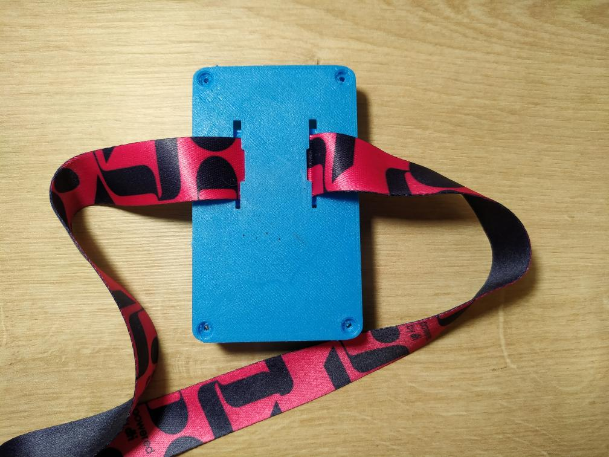

# Pixie 

## Intro

Pixie foi um projeto desenvolvido com a intenção de deixar as plantas que temos em casa mais interativas já que pra grande parte das pessoas
um dos desafios de se ter uma planta em casa é saber como cuidar, com que frequência aguamos, quando e quanto de sol é suficiente, etc.
Ao tempo que sensores trabalham para obter dados da planta, um display, propositalmente pixelizado (daí o nome Pixie), exibe expressões basicas que 
indicam o estado da planta, como alegria enquanto ela está sendo aguada ou tristeza caso a temperatura esteja muito alta, indicando que ela deveria 
ir para um lugar mais fresco.
Para tornar a experiência ainda mais interessante, foi adicionado outros sensores como de presença, toque e luminosidade traduzindo-se em outras
expressões que fazem parecer que agora você tem um pet virtual para cuidar.
 
O projeto possui diversos parâmetros em que é possivel personalizar os limites e necessidades de cada caso, considerando tanto a diversidade de 
plantas possiveis quanto sensores de diferentes marcas existentes. Como sabemos, há plantas que precisam mais de sol ou de água enquanto outras
conseguem viver com menos recursos, como os cactos por exemplo.

No decorrer desse artigo, vou apresentar o funcionamento e o passo-a-passo para se construir um Pixie utilizando um pouco de conhecimento de eletrônica,
componentes facialmente encontrados no mercado e uma impressora 3d para o case. Embora seja um projeto 100% funcional, existem diversas possibiladdes 
de customização e melhorias que será apresentado no fim do artigo.

## Componentes & Ferramentas

Todos os componentes são facilmente encontrados em lojas ou sites especializados.

- MCU ESP32 (Um Arduino Nano também pode ser usado caso não queira enviar dados pela internet)
- LDR
- Elemento PIR D203S ou similar (é o mesmo sensor usado nos módulos SR501 ou SR505)
- Sensor de temperatura DHT11
- Sensor de umidade do solo  
    - Opte por usar sensores capacitivos ao invés de resistivos, esse vídeo que explica bem porque https://www.youtube.com/watch?v=udmJyncDvw0
- Matriz de Led 8x8 com MAX7219 integrado
    - Usei esse modelo https://aliexpress.com/item/32801376173.html, mas poderia ser qualquer similar
- Resistor 4.7k
- Resistor 47k
- Resistor 10k

### Outros 

- Impressora 3d
- Ferro de Solda
- Alicate de Corte
- Fios para ligação do circuito

## Circuito 

O circuito pode ser visto na imagem acima usando um breadboard, mas para ser colocado no case, as conexões devem ser soldados diretamente 
para ocupar menos espaço. A questão do espaço utilizado foi um ponto importante do projeto, tentei reduzir ao máximo a área que 
o Pixie ia ocupar. Apesar da case ter ficado pequena, ainda é possível reduzir mais, principalmente desenvolvendo uma PCB 
exclusiva para essa finalidade.

PIR:
https://sites.google.com/a/gr0b.com/0_o/updates/pyroelectricinfraredsensorspirthermograph

Outra questão recorrente em projetos eletrônicos é a bateria, haviam algumas possibildades para esse caso, poderia se usar uma bateria de 9v 
ou uma recarregável, apesar de ser mais prático, um espaço extra ia ser necessário no case e acabei deixando a saída USB do MCU 
exposta de forma que o usuário decide como será a fonte de alimentação assim como o upload da sketch.

## Design e Impressão 3d

Juntamente com o circuito, uma case para acomodar os componentes do Pixie foi desenvolvida e impresso numa Ender 3 Pro usando PLA para a compartimeno principal e o frame, e PET para a parte da frente do produto. Alguns conceitos estiveram presentes durante esse desenvolvimento:

- Considerando que o vaso de planta está normalmente em cima de uma mesa, o display foi colocado ligeiramente inclinado para não perder a área de visualização
- Projetado para evitar qualquer tipo de suporte de impressão 
- Favorece a troca de partes por outras cores de forma a deixar o produto mais personalizado, design intercambiável e de encaixe
- O sensor de temperatura com abertura pro ambiente externo a possibilitar uma leitura mais correta
- Saída para a conexão com o sensor de solo e toque
- Considerando os diferentes tamanhos de vasos, a instalação do Pixie na planta pode ser feito de duas formas 
    - Através de uma vareta fixada na terra; ou
    - 
    - Usando uma cinta que envolve o vaso da planta
    - 

### Pontos de melhoria 

Embora funcional, existem alguns pontos no design que devem ser modificados, como o tamanho das paredes que foram definidos fim de evitar perda de 
material e agilizar a impressão durante a prototipação em 1mm.

Os encaixes precisam ser melhorados aplicando os padrões de design em impressão 3d, é muito provável que seja necessário ajustar o tamanho do encaixe da vareta 
e do stand para que fique com tamanho ideal após impresso.

O design do Pixie pode ser encontrado no Tinkercad em https://www.tinkercad.com/things/9b4d1D7Ybnd e do stand em https://www.tinkercad.com/things/aHyDhaKDAj6.

## Código

Como programador, posso dizer que foi a parte mais divertida de se trabalhar, pensar em como estruturar e organizar o código rendeu algumas horas de planejamento
e o resultado ficou bem satisfatório. O fato da maioria dos sensores usarem uma entrada analógica gerou um tratamento a parte do código de modo a tentar obter 
uma leitura mais fiel tentando ignorar ao máximo falsos positivos. Foi criado um diagrama com os principais blocos de código que pode ser visto abaixo, para mais
detalhes recomendo acessar o repositório presente em https://github.com/jnthas/pixie

Há vários pontos abertos a modificação que permitem customizar o Pixie como desejar. Entre eles posso destacar:

- Tempo de leitura dos sensores
- Tempo de timout de algumas expressões
- Limites max e min de temperatura, iluminação e solo assim como o threshold dos sensores
- Intensidade luminosa de cada expressão
- Tempo entre frames de cada expressão
- As animações estão separadas do código permitindo modificar caso assim o queira

### Triggers

Foi necessário implementar uma forma de detectar quando uma ação estava acontecendo em tempo real baseado nas últimas leituras. Isso foi necessário em trẽs casos conhecidos, watering, presence e touch, esses eventos devem ser disparados assim que é detectado uma variação consideravel do sensor e pra isso foi usado
uma implementação diferente. Um exemplo disso, é o sensor de presença, como foi usado somente o elemento PIR na entrada analógica, os valores lidos são muito variáveis e é necessário uma lógica para se declarar que há presença ou não ao passo que o sensor de temperatura, por sua vez tem uma variação muito baixa e 
basta a leitura padrão dos seus valores para acertar o comportamento do Pixie.

## Evolução do projeto

- Se tornar um dispositivo IoT e passar a enviar dados pra uma plataforma via MQTT
- App pra customização dos parametros e talvez das faces
- Fazer o touch funcionar ao tocar na planta (https://www.instructables.com/id/Touche-for-Arduino-Advanced-touch-sensing/)
- Incluir bateria 
- Imprimir o vaso completo nao somento o case do Pixie
- Incluir uma Piezo no projeto para tocar sons dependendo das expressões
- Extender a memória da Pixie com dados históricos (muito tempo sem detectar presença)
- Sensor UV

